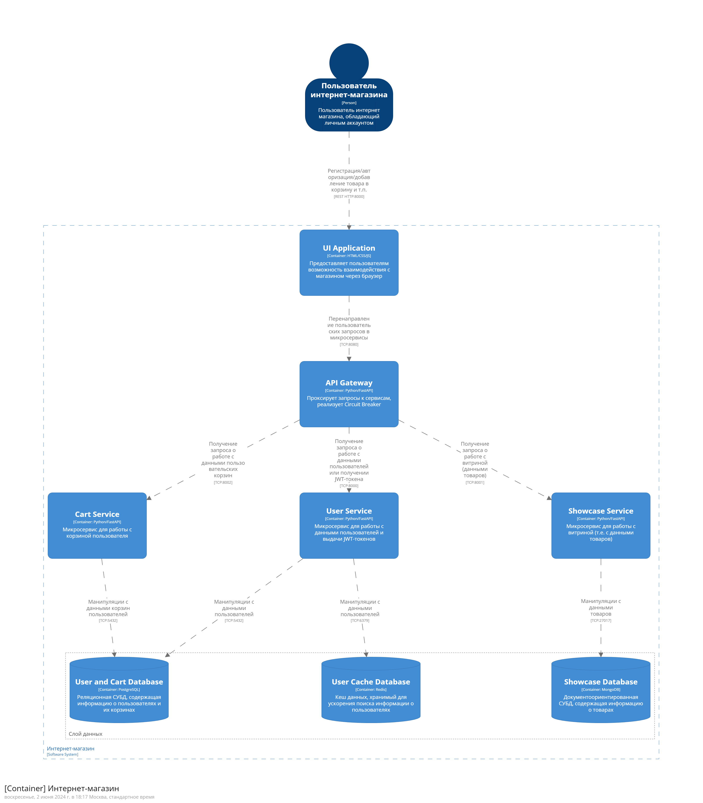

# Программная инжинерия (семестр весна 2024)
## Вариант 2 (Магазин)

Прототип приложения, ориентированного на хранение и обработку больших объемов данных, реализованного в виде кластера в Docker. Приложение имеет микросервисную архитектуру: реализовано три микросервиса для работы с базами данных, а также API Gateway для обрабоки и перенаправления запросов. Поддерживается система контроля доступа через JWT-токены. Создан тестовый скрипт для наполнения баз данных генерируемой искуственно информацией.

Архитектура приложения задокументирована языком описания архитектуры C4 DSL с помощью Structurizr (см. картинку).

### Используемые технологии
- docker
- docker compose для оркестрации и запуска кластера
- mongodb как хранилище данных о товарах
- postgresql как хранилище информации о пользователях и их корзинах
- redis для хранения кэша с информацией о пользователях
- python 3.11 в качестве основного языка программирования
- fastapi для rest-api приложения

### Состав кластера:
- api-gateway - проксирует запросы к сервисам, реализует circuit breaker
- cart-service - микросервис для работы с корзиной пользователя
- user-service - микросервис для работы с данными пользователей и выдачи JWT-токенов
- showcase-service - микросервис для работы с данными о товарах (с витриной)
Все вышеперчисленные контейнеры - кастомные, на базе python:3.11-bookworm с определёнными библиотеками.
- mongodb - один инстанс
- redis - один инстанс
- mongodb - один инстанс

- [x] Лабораторная работа №1
- [x] Лабораторная работа №2
- [x] Лабораторная работа №3
- [x] Лабораторная работа №4
- [x] Лабораторная работа №5
- [x] Лабораторная работа №6
